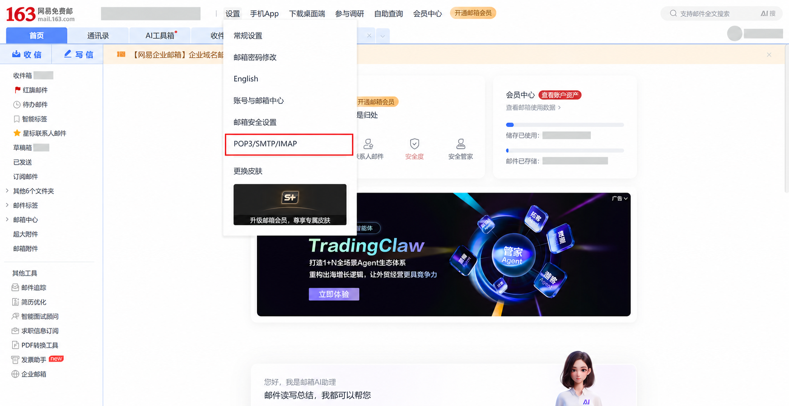
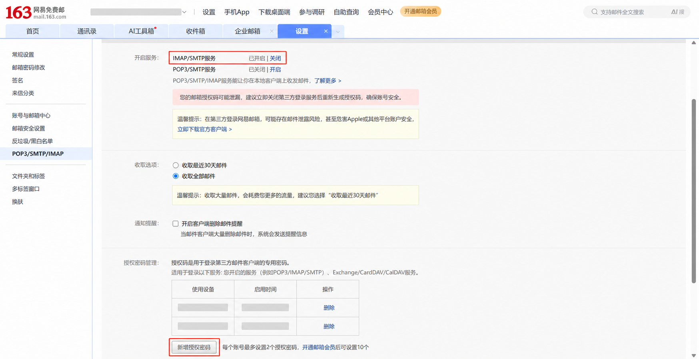
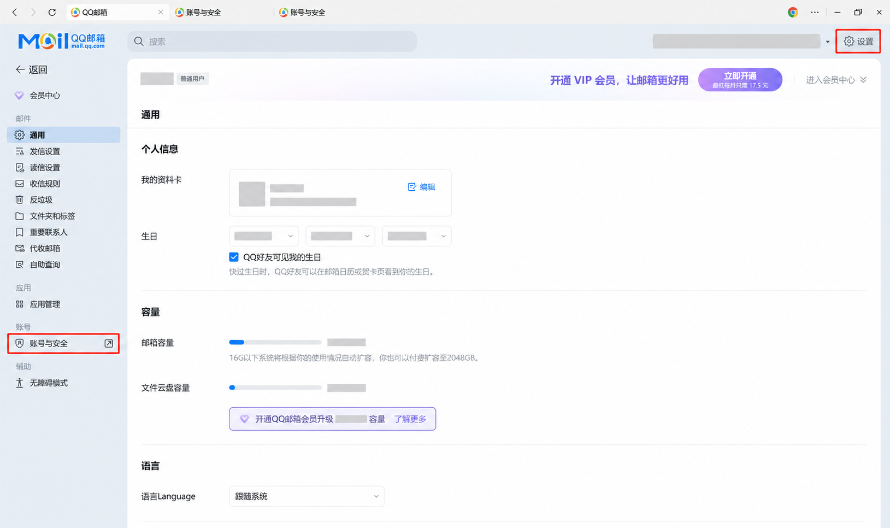
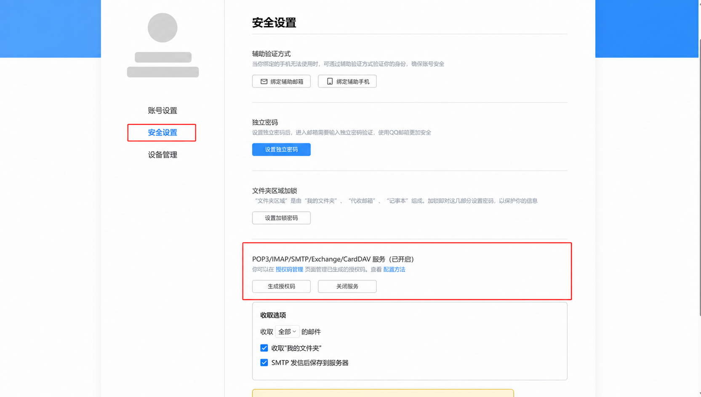

# 163 邮箱与 QQ 邮箱授权码获取教程

Mine Mail 通过 IMAP/SMTP 连接 163 邮箱和 QQ 邮箱。添加这两类账户时，密码栏应
填写邮箱服务商生成的**授权码（客户端专用密码）**，不要填写网页版邮箱的登录密码。

> 授权码与密码同样敏感。请勿将授权码发给他人、粘贴到聊天或提交到代码仓库；完成
> 配置后，也不要保留包含授权码的截图。服务商网页可能调整入口名称或位置，请以实际
> 页面为准。

## 163 邮箱

1. 在浏览器中登录 163 邮箱网页版。
2. 点击页面顶部的“设置”，在菜单中选择“POP3/SMTP/IMAP”。

3. 在“开启服务”区域确认“IMAP/SMTP服务”显示“已开启”。如果尚未开启，先点击
   “开启”，再按页面提示完成安全验证。
4. 向下找到“授权密码管理”，点击“新增授权密码”（部分页面可能显示为“新增授权码”），
   按提示完成验证并复制新生成的授权码。

5. 打开 Mine Mail，进入“设置 → 邮箱账户 → 添加邮箱”，选择 163 邮箱，填写完整邮箱
   地址，并将刚生成的授权码填入密码栏。

如果授权码疑似泄露，请立即回到“授权密码管理”删除该授权码，然后重新生成并更新
Mine Mail 中的账户凭据。

## QQ 邮箱

1. 在浏览器中登录 QQ 邮箱网页版。
2. 点击页面右上角的“设置”，再点击左侧边栏中的“账号与安全”。该入口通常会打开
   “账号与安全”页面。

3. 在“账号与安全”页面左侧点击“安全设置”。
4. 找到“POP3/IMAP/SMTP/Exchange/CardDAV 服务”，确认状态为“已开启”。如果服务
   尚未开启，先按页面提示开启。
5. 点击“生成授权码”，按提示完成安全验证并复制新生成的授权码。如果页面提供
   “授权码管理”，也可以从该入口管理或撤销已生成的授权码。

6. 打开 Mine Mail，进入“设置 → 邮箱账户 → 添加邮箱”，选择 QQ 邮箱，填写完整邮箱
   地址，并将刚生成的授权码填入密码栏。

## 无法登录时

- 确认填写的是新生成的授权码，而不是网页版邮箱的登录密码。
- 确认 IMAP/SMTP 服务已经开启。
- 重新复制授权码，避免带入前后空格或换行。
- 如果授权码已经撤销、过期或无法确认状态，请在邮箱网页端删除旧授权码并生成新的
  授权码，再回到 Mine Mail 更新凭据。
