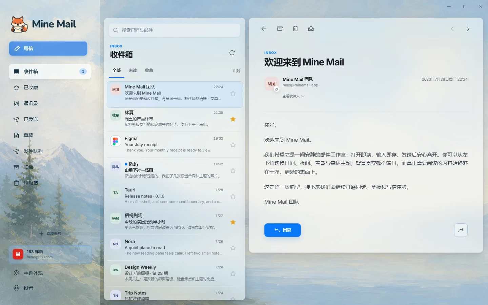
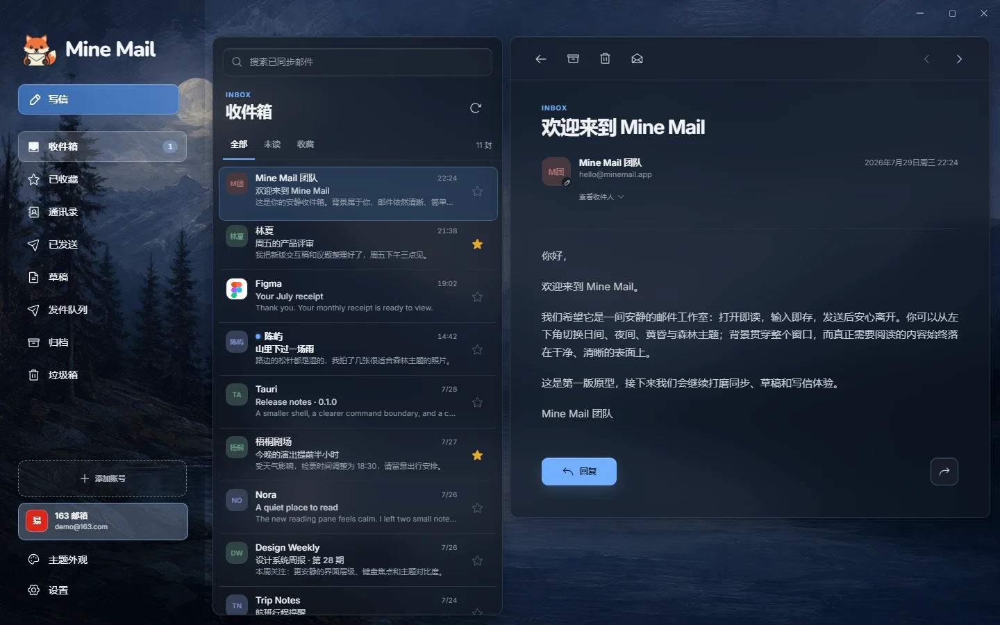
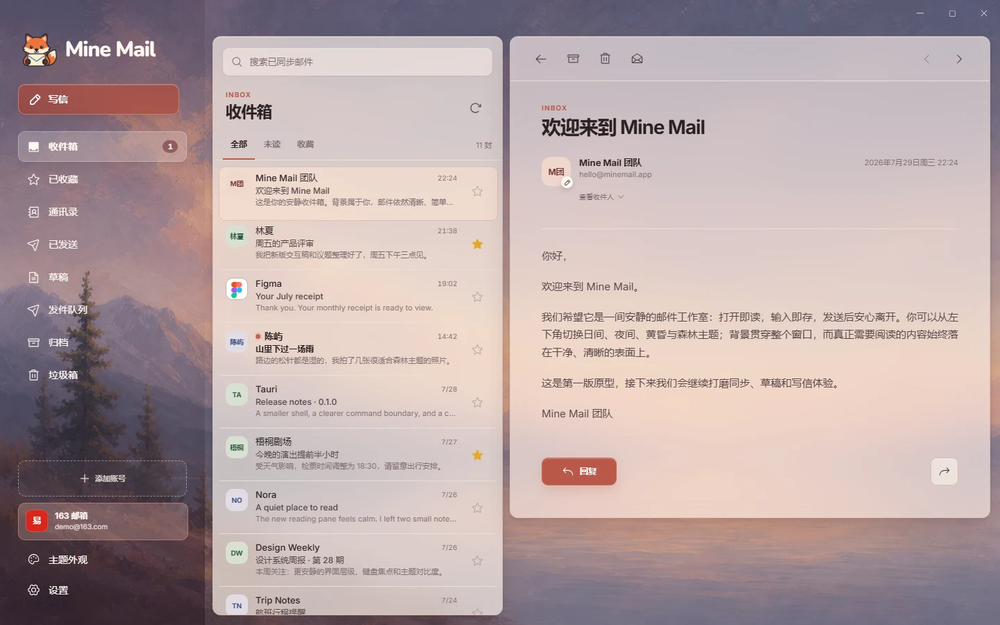
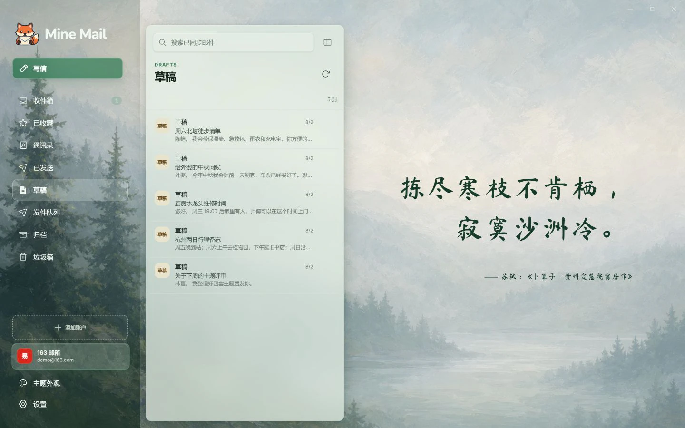

# Mine Mail

## 项目简介

Mine Mail 是一个本地优先、专注阅读体验的跨平台桌面邮箱客户端，使用
Tauri 2、React 19、Rust 与 SQLite 构建。

- 启动时优先读取本地缓存，再由 Rust 在后台同步邮箱。
- 支持 163 邮箱、QQ 邮箱、Gmail OAuth 2.0 和自定义 IMAP/SMTP 账户，最多连接 3 个账户。
- 提供邮件搜索、草稿与发件队列、纯文本/安全 HTML 阅读、桌面通知和四套主题。
- 凭据保存在操作系统凭据存储中；邮件内容按不可信输入处理并在 Rust 中清理。

Mine Mail v1.0.0 是首个正式版本，面向 Windows 11 x64、macOS 14 及以上版本的
Apple Silicon Mac，以及 Linux x64 发布。各平台安装包通过同一套发布门禁完成
构建、签名和验收。


<table>
  <tr>
    <td width="50%">
      <strong>Daylight · 日间</strong><br>
      
    </td>
    <td width="50%">
      <strong>Night · 夜间</strong><br>
      
    </td>
  </tr>
  <tr>
    <td width="50%">
      <strong>Dusk · 黄昏</strong><br>
      
    </td>
    <td width="50%">
      <strong>Forest · 森林</strong><br>
      
    </td>
  </tr>
</table>

## 安装向导

1. 打开 [Mine Mail 最新版本](https://github.com/Tantless/mine-mail/releases/latest)，
   阅读发行说明并下载与你的系统匹配的安装包：

   - Windows 11 x64（AMD/Intel 64 位处理器）：
     `Mine-Mail_<版本号>_x64-setup.exe`
   - macOS 14+ Apple Silicon：`Mine.Mail_<版本号>_aarch64.dmg`
   - Linux x64：Ubuntu/Debian 用户优先选择
     `Mine.Mail_<版本号>_amd64.deb`；其他现代发行版可使用免安装的
     `Mine.Mail_<版本号>_amd64.AppImage`

2. 退出正在运行的旧版本，然后运行安装包。Windows 安装向导支持选择安装目录；
   macOS 将 Mine Mail 拖入“应用程序”，Linux 按所选包格式完成安装。
3. 启动 Mine Mail，进入“设置 → 邮箱账户 → 添加邮箱”：

   - 163 邮箱使用邮箱地址和客户端授权密码，不要填写网页登录密码。
   - Gmail 通过浏览器完成 Google OAuth 授权。
   - 其他邮箱选择自定义账户，并填写服务商提供的 IMAP/SMTP 地址、端口和 TLS
     配置。

4. 首次同步完成前请保持应用运行。之后 Mine Mail 会先显示本地缓存，再在后台同步。

Mine Mail 的正式安装包仅通过 GitHub Releases 发布。如果 Release 页面没有你的
平台安装包，或系统提示无法验证开发者，请核对下载来源和发行说明，不要绕过系统
安全警告，也不要从第三方站点下载安装文件。

## 开发者

开始前安装 [Git](https://git-scm.com/)、[Node.js 24 LTS](https://nodejs.org/)、
[Rustup](https://rustup.rs/) 以及当前系统所需的
[Tauri 2 系统依赖](https://v2.tauri.app/start/prerequisites/)。仓库通过
`rust-toolchain.toml` 固定使用 Rust 1.97.0。

克隆仓库并安装前端依赖：

```powershell
git clone https://github.com/Tantless/mine-mail.git
cd mine-mail\web
npm ci
cd ..
```

启动完整 Tauri 桌面开发版：

```powershell
cd web
npm run tauri:dev
```

只开发 React 界面时，可以启用不连接真实邮箱的 mock 演示模式：

```powershell
cd web
$env:VITE_MINE_MAIL_DEMO = "1"
npm run dev
```

在 Bash 中使用：

```bash
cd web
VITE_MINE_MAIL_DEMO=1 npm run dev
```

提交改动前运行适用的检查：

```powershell
# Rust 邮件核心（仓库根目录）
cargo test

# React
cd web
npm test -- --run
npm run build

# Tauri runtime
cd src-tauri
cargo test
cargo check
```

构建当前平台的桌面安装包：

```powershell
cd web
npm run tauri:build
```

开发协作先阅读 [`AGENTS.md`](AGENTS.md)。修改界面前阅读
[`DESIGN.md`](DESIGN.md)；修改产品行为或邮件渲染前分别阅读
[`docs/PRODUCT.md`](docs/PRODUCT.md) 和
[`docs/MAIL_RENDERING.md`](docs/MAIL_RENDERING.md)。普通界面和核心开发不需要
任何真实凭据；Gmail OAuth 联调使用的私有配置必须放在被 Git 忽略的
`web/src-tauri/google-oauth-client.json`，严禁提交。
